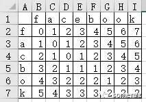

在使用搜索引擎时，当我们输入错误的关键词时，当然这里的错误是拼写错误，搜索引擎的下拉框中仍会显示以正确关键词为前前辍的提示，当你直接回车搜索错误的关键词时，搜索引擎的结果中仍包括正确关键词的结果。你有没有想过它是如何实现的呢?

<!-- more -->

前文[如何如何实现搜索框的关键词提示功能](https://mp.weixin.qq.com/s?__biz=MzU0OTg3NzU2NA==&mid=2247484214&idx=1&sn=911e61caffcd1be9901987e93884cd8f&chksm=fba86165ccdfe873b700e958adf77e8544742d8538ed5c8a014dcfd6d4c8314a1a81df428792&scene=21#wechat_redirect)分享了如何使用前辍树实现搜索框的关键词提示功能。今天分享一个拼写纠错的功能实现，其关键在于给定一个错误的关键词，如何返回一个正确的关键词。

最简单的方法，我们使用一个数组来存储正确关键词，对于给定的错误关键词，我们遍历此数组，找到与给定关键词最接近的关键词返回即可。

如何找到最接近的那个词呢？也就是说如何量化两个字符串的相似度 ?

通常有两种方法：

- 求两个字符串的编辑距离，编辑距离越小，两个字符串越相近。
- 求两个子符串的最长公共子序列，长度越大，两个字符串越相近。


编辑距离（莱文斯坦距离）就是从一个词变成另一个词需要的最小编辑次数。这里的编辑是指删除、替换、或插入。比如 facbok 和 facebook 的编辑距离就是 2 ，因为最小的操作是插入 2 次。比如 faccbook 和 facebook 的编辑距离就是 1 ，因为只需要替换 1 次。


## 最小编辑距离

如何求两个字符串的编辑距离？先考虑如何人脑如何有效的识别编辑距离：

```python
facbok (字符串a)
facebook (字符串b)
```

我们从最开始的两个空串开始，初始编辑距离为0，分别遍历两个字符串，如果一样，则指针 index 后移，如果不一样，有以下三种情况：

1、在字符串 a (或字符串b) 中 index 处的字符删除，编辑距离 +1，然后比较 a[index+1] 与 b[index]

2、在字符串 a (或字符串b) 中，a[index]前的位置插入一个字符，编辑距离 +1，然后比较 a[index] 与 b[index+1]

3、在字符串 a (或字符串b) 中，a[index]的位置替换一个字符，编辑距离+1，然后比较 a[index+1] 与 b[index+1]

循环结束，比较 3 种情况，找出距离最小的即可。基于以上思路，我们可以画个表格来尝试找规律：



字符 f = f ，因此单元格 B2 的值为 0 ，相应的 f 与 fa 的编辑距离为 1 因此 C2 的位置是 1，同理可得第 1 行和第 A 列的编辑距离。

接下来求 C3，C3 的值可以 C2 增加一个字符，B3 删除一个字符，或者 B2 替换一个字符转化而来，这三者的最小距离为
min(1+1,1+1,0+0) = 0 ，同样的道理可以得出其余所有格子的数值。

比如：E5 = min(E4+1,D5+1, 0+INT(E1!=A5)) = 1

最终的结果即 I7 的结果为 2。

以上过程可以很容易翻译成编程语言的，这里以 Python 为例：

```python 
def levenshtein_dp(s: str, t: str) -> int:
    """
    计算莱文斯坦距离（Levenshtein distance），距离越小，说明两个单词越相近，时间复杂度为 O(mxn)
    :param s:
    :param t:
    :return:
    """
    m, n = len(s), len(t)
    table = [[0] * (n + 1) for _ in range(m + 1)]
    table[0] = [j for j in range(n + 1)]
    # print(table)
    for i in range(m + 1):
        table[i][0] = i
    for i in range(1, m + 1):
        for j in range(1, n + 1):
            table[i][j] = min(
                1 + table[i - 1][j],
                1 + table[i][j - 1],
                int(s[i - 1] != t[j - 1]) + table[i - 1][j - 1],
            )
    return table[-1][-1]
```

Python 的标准库 difflib 也可以实现此功能，效率还略高些：

```python
import difflib
def difflib_leven(str1, str2):
    '''
    使用difflib计算莱温斯坦距离
    '''
    leven_cost = 0
    s = difflib.SequenceMatcher(None, str1, str2)
    for tag, i1, i2, j1, j2 in s.get_opcodes():
        # print('{:7} a[{}: {}] --> b[{}: {}] {} --> {}'.format(tag, i1, i2, j1, j2, str1[i1: i2], str2[j1: j2]))
        if tag == "replace":
            leven_cost += max(i2 - i1, j2 - j1)
        elif tag == "insert":
            leven_cost += j2 - j1
        elif tag == "delete":
            leven_cost += i2 - i1
    return leven_cost
```


为了得到正确的拼写，你还需要下面的函数：

```python
def get_right_word_from_lewen(method_name,all_words, input_word):
    """
      输入一个单词，返回计算莱文斯坦距离最小的单词
      :param input_word:
      :return:
      """
    words = all_words  # 获取所有正确的单词
    right_word = input_word
    min_distance = 99999
    for item in words:
        distance = method_name(input_word, item)
        if distance == 0:
            return item
        elif min_distance > distance:
            min_distance = distance
            right_word = item
    return right_word
```


## 最大公共子序列

有时候最小编辑距离并不好用，比如用户输 “abcd” ，正确的词语有两个“abc”，“abfcde”。如果按照最小编辑距离得到的正确输入就是“abc”，如果按照最大公共子序列，得到的正确结果就是“abfcde”，如果后者是更相关的，那么我们就需要借助于最大公共子序列。

最长公共子序列长度从相反的角度来量化相似度，通过最小次数的删除，增加操作后，两个字符串达到相同时的长度。比如  facbok 和 facebook 的最大公共子序列长度是 6。 最长公共子序列是一个十分实用的问题，它可以描述两段文字之间的“相似度”，即它们的雷同程度，从而能够用来辨别抄袭。对一段文字进行修改之后，计算改动前后文字的最长公共子序列，将除此子序列外的部分提取出来，这种方法判断修改的部分，往往十分准确。

解法就是用动态回归的思想，一个矩阵记录两个字符串中匹配情况，若是匹配则为左上方的值加1，否则为左方和上方的最大值。一个矩阵记录转移方向，然后根据转移方向，回溯找到最长子序列。

懒得画图了，自己可以画个矩阵来先用大脑算一下：

```python
def common_substring_dp(s: str, t: str) -> int:
    m, n = len(s), len(t)
    table = [[0] * (n + 1) for _ in range(m + 1)]
    for i in range(1, m + 1):
        for j in range(1, n + 1):
            table[i][j] = max(
                table[i - 1][j],
                table[i][j - 1],
                int(s[i - 1] == t[j - 1]) + table[i - 1][j - 1],
            )
    return table[-1][-1]
```

为了得到正确的拼写，你还需要下面的函数：

```python
def get_right_word_from_common_substring(all_words,input_word):
    '''
    输入一个单词，返回最长公共子序列长度最大的单词
    :param input_word:
    :return:
    '''
    words = all_words #获取所有正确的单词
    right_word = input_word
    min_distance = 0
    for item in words:
        distance = common_substring_dp(input_word,item)
        if min_distance < distance:
            min_distance = distance
            right_word = item
    return right_word
```


## 最终的效果

```python
词典共有词语 223292 个
请输入词语，q 退出：乱七八糟
最小编辑距离的结果:  乱七八糟
编辑距离为：0
耗时 0.1454 秒
最大公共子序列的结果： 乱七八糟
最大公共子序列的长度：4
耗时 0.1856 秒
请输入词语，q 退出：太虚环境
最小编辑距离的结果:  太虚幻境
编辑距离为：1
耗时 1.9054 秒
最大公共子序列的结果： 太虚幻境
最大公共子序列的长度：3
耗时 2.6669 秒
请输入词语，q 退出：了此不疲
最小编辑距离的结果:  乐此不疲
编辑距离为：1
耗时 1.8734 秒
最大公共子序列的结果： 乐此不疲
最大公共子序列的长度：3
耗时 2.5733 秒
```


完整的可以一键运行的代码已经准备好，[https://github.com/somenzz/geekbang/tree/master/mathOfProgramer](https://github.com/somenzz/geekbang/tree/master/mathOfProgramer)

